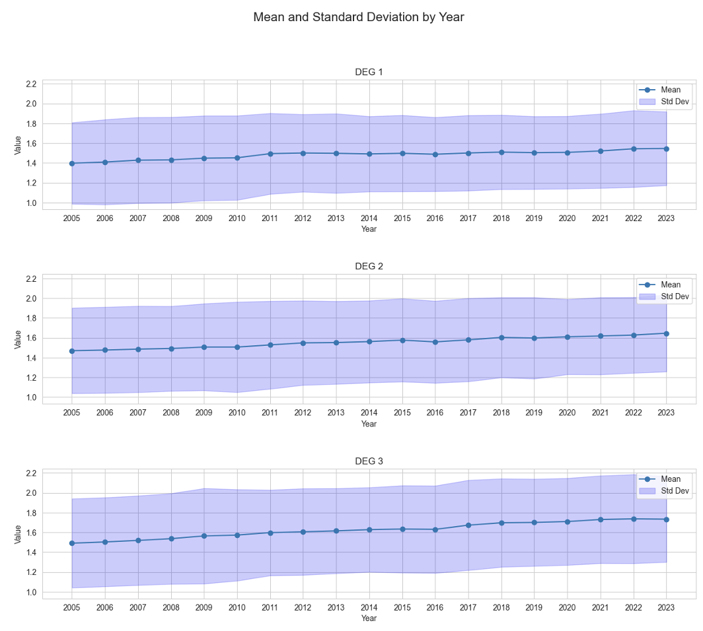
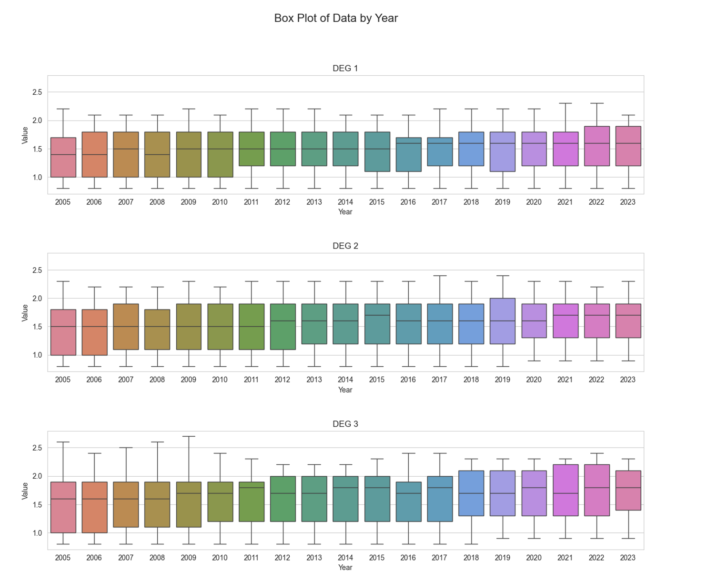

## Methodology

After splitting the dataset into three by degrees 1, 2, and 3, we fill in the missing values for each country with the adjacent years’ values. Each of the final datasets contains 32 countries and value from 2005 to 2023. With the well-prepared datasets, we had some descriptive statistical analysis to explore some potential useful discoveries or trends. We calculated the yearly mean, standard deviation, median, max values, and min values for all the countries, and the country mean for all the years. Box plots were used to show the data distribution by year, line charts were used for mean and standard deviation by year, time series line charts by country, heatmap by country and year for each degree of urbanization. As the datasets are for 19 years from 2005 to 2023, we created two lag features and split the data into training and testing parts for each dataset to better fit the models, including Ridge, Lasso, Random Forest, Gradient Boosting, Ada Boost, and SVR. We used MSE, R2, and AIC to estimate each model and MSE as the determinator to choose the best model and plot the results. Then we also used RandomizedSearchCV to do Hyperparameter Tuning to better adjust the parameters to fit the models and choose the best one.

## Results
1.	The room values have an increasing trend over the years from 2005 to 2023.

2. The room numbers for degree 2 areas are steadier and the differences between max and min are smaller than the others. For degree 3 areas, the differences are larger, the changes over the years are more than the other urbanization degrees’ rooms.

3.	Top countries that have larger value for all degrees of urbanization: Belgium, Cyprus, Ireland, Malta, Netherlands, Norway

4.	With the ridge model, all three degrees’ datasets fit the best, with the test data having MSE (mean squared error) of around 0.003, R2-value of about 0.98, and AIC (Akaike Information Criterion) of about -750. The model fits the datasets well and is not overfitting.
